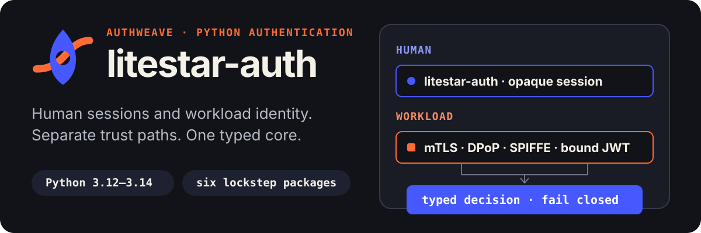

<p align="center">
  
</p>

<p align="center">
  <strong>One Python authentication stack. Separate trust paths for people and machines.</strong>
</p>

<p align="center">
  <a href="https://github.com/ZYLVEXT/litestar-auth/actions/workflows/1_test.yml">
    
  </a>
  <a href="https://app.codecov.io/gh/ZYLVEXT/litestar-auth">
    
  </a>
  <a href="https://pypi.org/project/litestar-auth/">
    
  </a>
  <a href="https://pypi.org/project/litestar-auth/">
    
  </a>
  <a href="./LICENSE">
    
  </a>
</p>

`litestar-auth` 7 is the human-authentication layer in a coordinated three-package stack for
Python 3.12–3.14. It keeps browser sessions, workload credentials, and framework-neutral
coordination in explicit packages instead of mixing them behind one credential parser.

## Choose the layer you need

| Package | Use it for | Install |
| --- | --- | --- |
| [`litestar-auth`](https://pypi.org/project/litestar-auth/) | Registration, login, OAuth + PKCE, TOTP, roles, organizations, and opaque database or Redis sessions in Litestar | `uv add litestar-auth` |
| `authweave-core` | Typed principals, evidence, decisions, route policies, and fail-closed provider coordination | `uv add authweave-core` |
| `authweave-workload` | X.509 workload lifecycle, direct mTLS, and externally issued certificate-bound JWTs | `uv add 'authweave-workload[mtls,jwt]'` |

All three distributions use coordinated `7.x` versions. The dependency direction stays one-way:

```text
authweave-core
├── litestar-auth
└── authweave-workload
    └── authweave-workload[litestar] → litestar-auth Extension SDK v2
```

## Start with a secure human session

```bash
uv add litestar-auth aiosqlite
```

```python
from uuid import UUID

from litestar import Litestar
from litestar_auth import DatabaseTokenAuthConfig, LitestarAuth, LitestarAuthConfig

config = LitestarAuthConfig(
    database_token_auth=DatabaseTokenAuthConfig(
        token_hash_secret=session_digest_secret,
    ),
    csrf_secret=csrf_secret,
    session_maker=session_maker,
    user_model=User,
    user_manager_class=UserManager,
    user_db_factory=user_db_factory,
    user_manager_security=user_manager_security,
)

app = Litestar(plugins=[LitestarAuth(config)])
```

The [quickstart](docs/quickstart.md) covers schema requirements and links the runnable
registration/login flow. Use `RedisTokenStrategy` with `litestar-auth[redis]` when sessions belong
in Redis. Both implementations issue opaque access and refresh tokens, rotate refresh tokens,
revoke replayed chains, and expose safe session metadata.

## Keep machine identity on its own path

```bash
uv add 'authweave-workload[mtls,jwt,sqlalchemy]'
# Add [litestar] only for the Extension SDK v2 integration.
```

`WorkloadLifecycleService` manages service applications, principals, public certificate metadata,
overlapping rotation, revocation, and same-transaction security events. Private keys are rejected
at the package boundary and are never stored.

At request time:

- `DirectMTLSProvider` consumes trusted TLS peer evidence.
- `MTLSBoundJWTProvider` verifies an asymmetric access token from a configured external issuer.
- The token's RFC 8705 thumbprint must match the same peer certificate.
- Ambiguous credential ownership and provider failures stop authentication; they never fall
  through to another provider.

The repository includes an Envoy-based reference stack with negative-path verification:

```bash
sh docker/reference/verify.sh
```

## Security boundary

Authentication establishes a verified principal and constraints. Your application still owns
tenant mapping, row-level security, resource ownership, and business authorization.

Version 7 intentionally does **not** provide bearer login, user-owned API keys, proprietary HMAC
request signing, an OAuth Authorization Server, generic IAM, DPoP, SPIFFE, opaque-token
introspection, or production rollout automation.

## Documentation

- [Quickstart](docs/quickstart.md)
- [Installation and extras](docs/install.md)
- [Architecture contract](docs/architecture.md)
- [Security posture](docs/security.md)
- [Vulnerability reporting](SECURITY.md)
- [Version 7 migration](docs/migration.md)
- [Changelog](CHANGELOG.md)
- [Deployment reference](docs/deployment.md)
- [Contributing](docs/contributing.md)

## License

[MIT](LICENSE)
