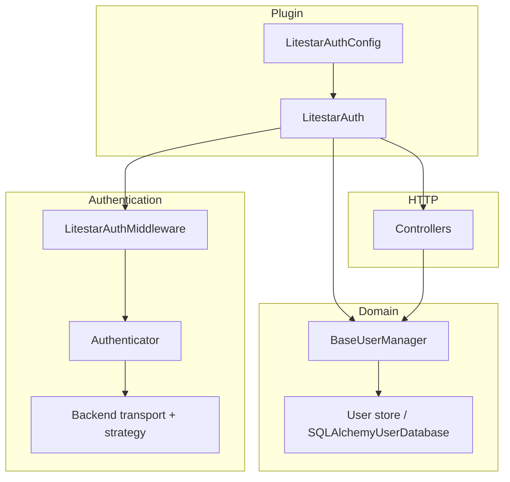

# Architecture

litestar-auth is organized in layers. The product goal is a **Litestar-native** plugin that composes **transport + strategy** backends and keeps HTTP flows declarative.

## Plugin orchestration

`LitestarAuth` (`litestar_auth.plugin`) is an `InitPlugin` that, on app init:

- Registers DI providers for config, user manager, backends, and user model.
- Prepends authentication middleware.
- Mounts generated controllers (auth, register, verify, reset, users, TOTP, OAuth) according to flags.
- Registers exception handlers for structured error responses.

Configuration is a single `LitestarAuthConfig` dataclass (see [Configuration](../configuration.md)).

## Backend model: transport + strategy

An `AuthenticationBackend` pairs:

- **Transport** — how credentials travel (e.g. `Authorization: Bearer`, or HTTP-only cookies).
- **Strategy** — how access (and optionally refresh) tokens are created, validated, rotated, and revoked (`JWTStrategy`, `DatabaseTokenStrategy`, `RedisTokenStrategy`).

Multiple backends can be configured; the first successful authentication wins for a request. Additional backends may be mounted under path prefixes (see [Backends](backends.md)).

## Middleware vs guards

- **Middleware** attempts authentication and sets `request.user` when a backend recognizes the request. It does **not** automatically return 401 for anonymous users.
- **Guards** (`is_authenticated`, `is_active`, `is_verified`, `is_superuser`, `has_any_role(...)`, `has_all_roles(...)`) enforce access on handlers and route groups.
- Role guards stay intentionally narrow: they operate on flat normalized role membership and fail closed if the authenticated user does not expose the documented role-capable contract.

This matches Litestar’s pattern: authentication is ambient; authorization is explicit.

## User manager

`BaseUserManager` holds business rules: password hashing and upgrade, verification and reset tokens, hooks, user updates, OAuth account coordination, and invalidation of sessions tied to request-local backends after sensitive changes.

## Controllers

HTTP endpoints are built from factory functions (e.g. `create_auth_controller`) and attached by the plugin. You can replace or extend behavior via configuration and hooks documented under [Extending](../guides/extending.md).
