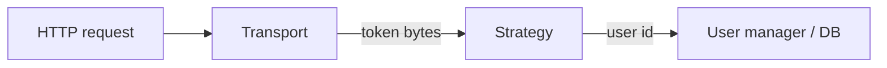

# Backends: transports and strategies

A backend is **`AuthenticationBackend(name, transport, strategy)`**. Transports read tokens from the request; strategies interpret and persist them.



## Transports

| Transport | Typical use |
| --------- | ----------- |
| `BearerTransport` | APIs, SPAs with `Authorization: Bearer`. |
| `CookieTransport` | Browser sessions; pairs with CSRF for unsafe methods (see [Security](../security.md)). |

## Strategies

| Strategy | Behavior |
| -------- | -------- |
| `JWTStrategy` | Stateless access tokens; optional `jti` denylist; optional session fingerprint claim. |
| `DatabaseTokenStrategy` | Opaque tokens stored in DB (keyed digest at rest; legacy plaintext opt-in only). |
| `RedisTokenStrategy` | Opaque tokens in Redis (`litestar-auth[redis]`). |

Constructors and options are documented under [Python API — Strategies](../api/strategies.md).

## Canonical opaque DB-token setup

For the common bearer + database-token plugin flow, prefer the plugin-owned preset instead of hand-assembling the backend:

```python
from litestar_auth import DatabaseTokenAuthConfig, LitestarAuthConfig
from litestar_auth.manager import UserManagerSecurity

config = LitestarAuthConfig(
    database_token_auth=DatabaseTokenAuthConfig(
        token_hash_secret="replace-with-32+-char-db-token-secret",
    ),
    user_model=YourUserModel,
    user_manager_class=YourUserManager,
    session_maker=session_maker,
    user_manager_security=UserManagerSecurity(
        verification_token_secret="replace-with-32+-char-secret",
        reset_password_token_secret="replace-with-32+-char-secret",
    ),
)
```

`session_maker` here is any callable object compatible with `session_maker() -> AsyncSession`; `async_sessionmaker(...)` is the usual implementation, not the only supported one.
Manager-scoped secrets, shared `PasswordHelper` injection, runtime password validation, and app-owned
schema helper reuse still follow the same
[canonical configuration contract](../configuration.md#canonical-manager-password-surface). Keep
manager secrets on `user_manager_security`; reserve `user_manager_kwargs` for non-security
dependencies or custom `user_manager_factory` inputs.

At runtime this still becomes a normal `AuthenticationBackend`, but the preset keeps request-session binding and migration-only rollout flags on the plugin side.

## Order and multiple backends

- Middleware tries backends **in order**; the first that yields a user wins.
- The **first** backend is exposed under the configured `auth_path` (default `/auth`).
- **Additional** backends are mounted under `/auth/{backend-name}/...` so paths do not collide.
- Manual `AuthenticationBackend(...)` assembly remains the advanced escape hatch for multi-backend or custom transport setups.

Name backends explicitly when you have more than one:

```python
AuthenticationBackend(name="api", transport=BearerTransport(), strategy=jwt_strategy)
AuthenticationBackend(name="mobile", transport=BearerTransport(), strategy=db_strategy)
```

## Choosing a stack

- **Public API / microservice:** often `BearerTransport` + `JWTStrategy` with a durable denylist in production if you rely on revocation.
- **Same-site browser app:** `CookieTransport` + strategy of your choice; enable CSRF for state-changing requests.
- **Central session store:** use `LitestarAuthConfig(..., database_token_auth=DatabaseTokenAuthConfig(...))` for the canonical bearer + DB-token path, or `RedisTokenStrategy` when Redis is your session store. Drop to manual `DatabaseTokenStrategy` assembly only when you need a non-canonical transport or multiple backends.

See also [Request lifecycle](request_lifecycle.md).
