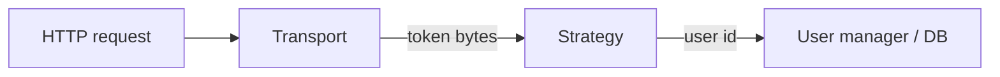

# Backends: transports and strategies

A backend is **`AuthenticationBackend(name, transport, strategy)`**. Transports read tokens from the request; strategies interpret and persist them.



## Transports

| Transport | Typical use |
| --------- | ----------- |
| `BearerTransport` | APIs, SPAs with `Authorization: Bearer`. |
| `CookieTransport` | Browser sessions; pairs with CSRF for unsafe methods (see [Security](../security.md)). |

## Strategies

| Strategy | Behavior |
| -------- | -------- |
| `JWTStrategy` | Stateless access tokens; optional `jti` denylist; optional session fingerprint claim. |
| `DatabaseTokenStrategy` | Opaque tokens stored in DB (keyed digest at rest; legacy plaintext opt-in only). |
| `RedisTokenStrategy` | Opaque tokens in Redis (`litestar-auth[redis]`). |

Constructors and options are documented under [Python API — Strategies](../api/strategies.md).

## Order and multiple backends

- Middleware tries backends **in order**; the first that yields a user wins.
- The **first** backend is exposed under the configured `auth_path` (default `/auth`).
- **Additional** backends are mounted under `/auth/{backend-name}/...` so paths do not collide.

Name backends explicitly when you have more than one:

```python
AuthenticationBackend(name="api", transport=BearerTransport(), strategy=jwt_strategy)
AuthenticationBackend(name="mobile", transport=BearerTransport(), strategy=db_strategy)
```

## Choosing a stack

- **Public API / microservice:** often `BearerTransport` + `JWTStrategy` with a durable denylist in production if you rely on revocation.
- **Same-site browser app:** `CookieTransport` + strategy of your choice; enable CSRF for state-changing requests.
- **Central session store:** `DatabaseTokenStrategy` or `RedisTokenStrategy` for server-side invalidation without JWT denylists.

See also [Request lifecycle](request_lifecycle.md).
