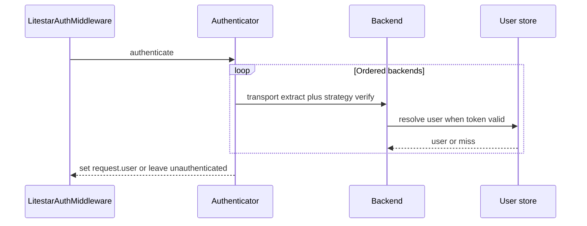

# Request lifecycle

## Incoming request

Middleware does **not** send **401**; the request continues to routing and guards.

1. **LitestarAuthMiddleware** runs early. It uses an **Authenticator** that loops over configured `AuthenticationBackend` instances.
2. For each backend, the **transport** extracts a token (header, cookie, etc.).
3. The **strategy** validates the token and resolves the user id; the manager loads the user from the database.
4. If successful, **`request.user`** is set to the authenticated user (type is your configured user model / protocol).
5. If no backend succeeds, the request continues **without** `request.user` (or with an anonymous placeholder, depending on Litestar version and your app) — **no 401 is raised here**.

## Protected routes

Handlers (or routers) use **guards**:

- `is_authenticated` — user must be present and authenticated.
- `is_active` — `is_active` on the user model.
- `is_verified` — `is_verified` on the user model.
- `is_superuser` — admin-only operations.
- `has_any_role(...)` / `has_all_roles(...)` — flat normalized role membership on an authenticated active user.

Role guards fail closed when `request.user` does not expose the documented
role-capable surface. When a guard fails, Litestar returns **401** or **403**
with the library’s structured error payload where applicable.

## Logout and refresh

- **Logout** invokes strategy-specific teardown (e.g. cookie clearing, token revocation).
- **Refresh** (`POST .../refresh`) is only registered when `enable_refresh=True` on the config; behavior depends on the strategy and transport (see [Cookbook — Refresh with cookies](../cookbook/refresh_cookie.md)).

## OAuth and TOTP

These add extra steps:

- **OAuth** — redirect to provider, callback establishes or links a session; state is validated via cookie (see [OAuth guide](../guides/oauth.md)).
- **TOTP** — login may return a **pending** token until `POST .../2fa/verify` completes (see [TOTP guide](../guides/totp.md)).

For the exact paths, see [HTTP API](../http_api.md).
