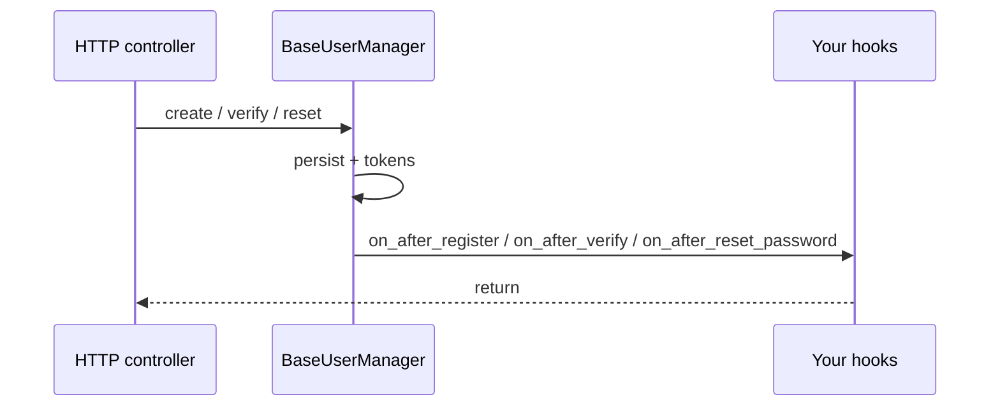

# Lifecycle hooks

Subclass **`BaseUserManager`** and override async hooks to integrate email, analytics, or domain side effects. The default no-op implementations now live on **`UserManagerHooks`**, which `BaseUserManager` inherits, so existing subclasses keep the same override points. Hooks are **best-effort** extension points: keep them fast; offload I/O to background tasks when needed.

!!! warning "Timing and `on_after_forgot_password`"
    `forgot_password` uses enumeration-resistant logic in the manager. **`on_after_forgot_password`** runs after that path and may perform I/O (e.g. sending email). Timing differences from real SMTP or HTTP calls can still leak information unless you delegate to a **queue or background worker**. See [Registration](registration.md).

## Hook reference

| Hook | When it runs | Typical use |
| ---- | ------------ | ----------- |
| `on_after_register(user, token)` | After a new user is persisted and a verification token exists | Send verification email, analytics |
| `on_after_login(user)` | After a successful login issues a session / tokens | Audit, last-login updates |
| `on_after_verify(user)` | After email verification succeeds | Welcome email, entitlement updates |
| `on_after_request_verify_token(user, token)` | After verify-token handling completes (`user` and `token` may be `None` for unknown or already-verified emails) | Resend verification email; **always** do equivalent async work whether `user` is `None` |
| `on_after_forgot_password(user, token)` | After forgot-password handling (`user` and `token` may be `None` when unknown email) | Send reset email; **always** do equivalent async work whether `user` is `None` (see manager docstring) |
| `on_after_reset_password(user)` | After password successfully changed | Notify user, revoke other sessions (strategies also invalidate) |
| `on_after_update(user, update_dict)` | After profile fields saved | Sync directory, re-index search |
| `on_before_delete(user)` | Before user deletion | Soft checks, cascade hints |
| `on_after_delete(user)` | After user removed (or soft-deleted per policy) | GDPR export cleanup, cache purge |

Exact signatures and default implementations live on **`UserManagerHooks`**, inherited by **`BaseUserManager`** — see [Manager API](../api/manager.md).

## Flow sketch (register → verify → reset)

## Related

- [Extending](extending.md) — user model, factories, controllers.
- [Registration](registration.md) — verification and forgot-password semantics.
